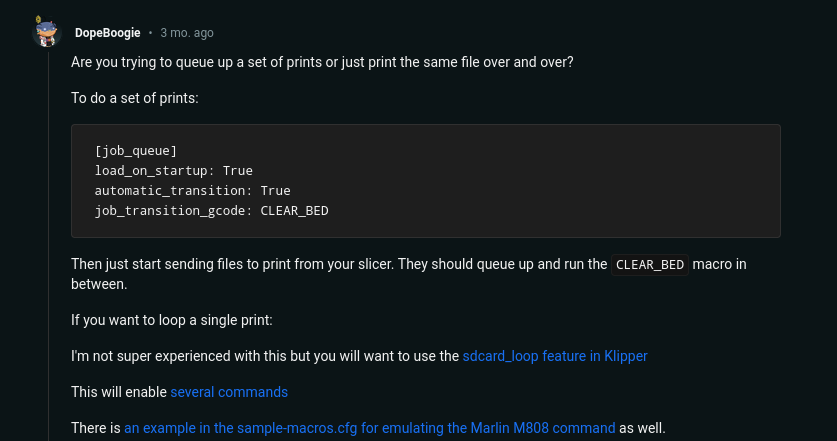
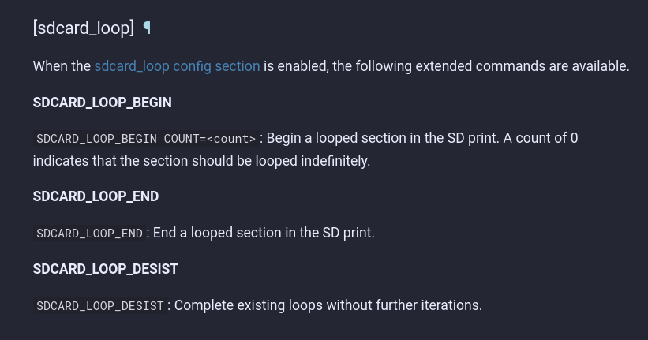
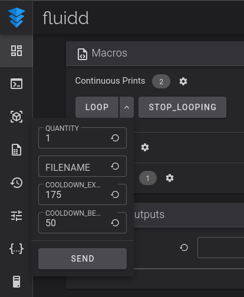
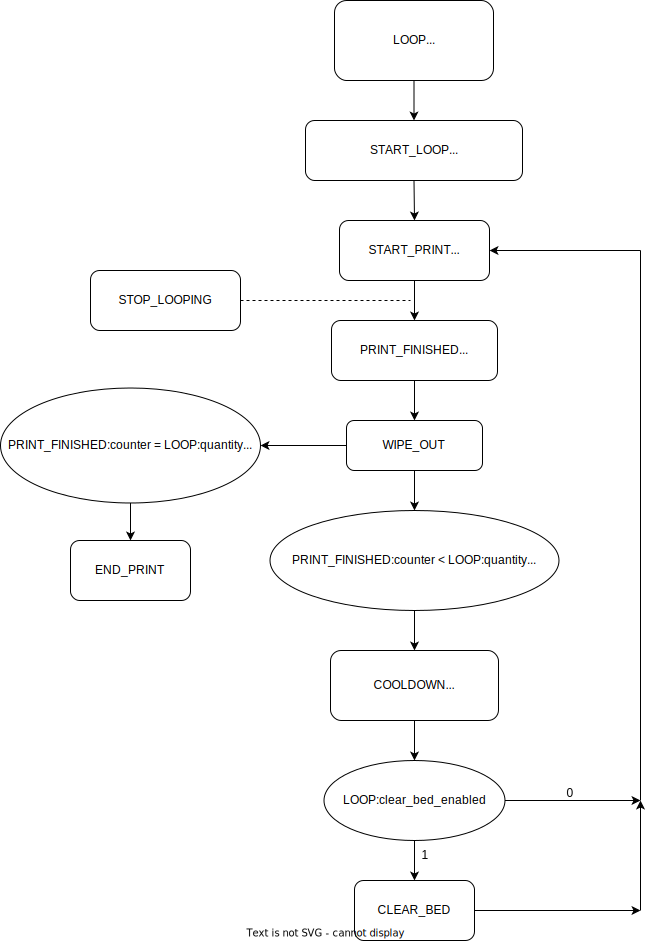

# continuous-prints-klipper
TLDR: Continuous printing of a single gcode file with user-defined # of iterations, bed clearing, cooldown temperatures, and more, while still maintaining original "print from slicer" functionality. (Klipper, Moonraker, Fluidd, Cura, mostly stock Ender 3 Pro w/ BLTouch)

**This has not been extensively tested, use/modify at your own risk!**

## Introduction
In an attempt to set up continuous printing on a Klipper enabled 3D printer, little information could be found regarding this. With Octoprint, there are various plugins for accomplishing this task (for example: [Continuous Print plugin](https://plugins.octoprint.org/plugins/continuousprint/)). In Klipper, a job queue can be set up to continuously receive prints from the user's preferred slicer of choice, clearing the bed after every print.

However, the goal of this repo is to allow the continuous print of a single gcode file, for however many iterations as defined by the user, while still maintaining the original "print from slicer" functionality available through the Moonraker plugin on Cura. As the user (shout out to DopeBoogie, thanks!) suggested in the figure above, the "sdcard_loop" features in Klipper can be utilized to achieve this goal.

By replacing start and end scripts with those provided from this repo in Cura, adding the supplied macros to your printer.cfg file (backup your printer.cfg before trying this, attempt at your own risk), and organizing the macros in the Fluidd web ui, the following is the result.

## Flow Chart

## A Few Caveats
 - If entering the "filename" in the LOOP macro via Fluidd ui, the "filename" must not contain spaces.
 - User must supply their own gcode for priming the nozzle, clearing the bed, start/end macro, etc. as these will vary based on the printer's configuration, size and location of part being printed, etc.. Although the gcode is supplied, for OUR use-case, verify compatibility before potentially causing damage to your precious hardware (again, HessFab is not responsible). 
 - Configuration was based on the following platforms: 
   - Printer: Mostly stock Ender 3 Pro w/ BLTouch
   - Firmware: Klipper
   - API: Moonraker
   - Web Interface: Fluidd
   - Slicer: Cura
